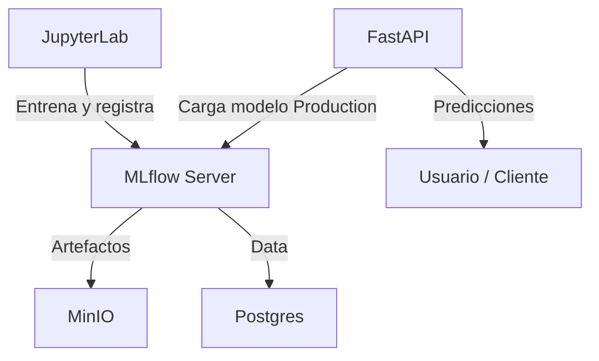
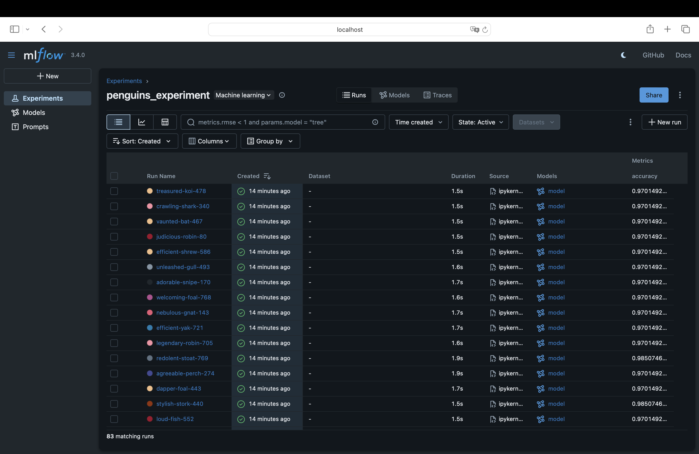
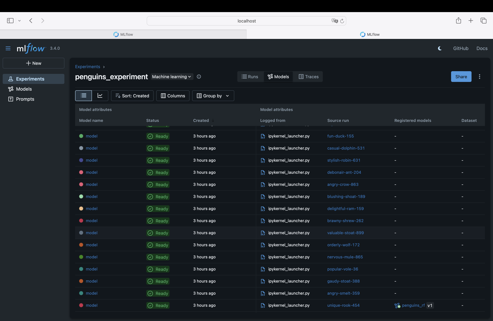
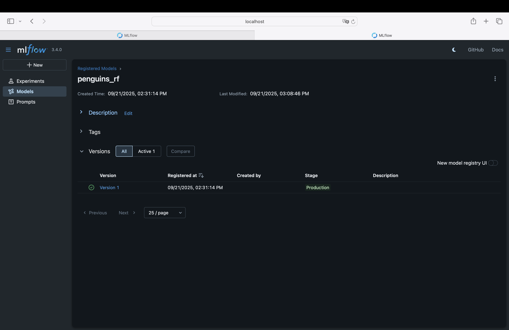
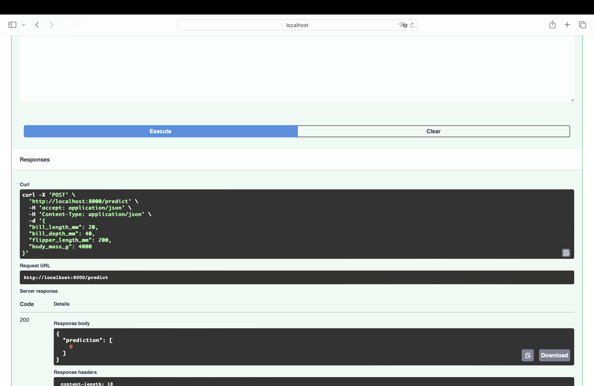

# Operacion de aprendizaje automático - Taller 4 MLflow

- Yibby Gonzalez
- Sebastián Ruiz
- Adrián Tellez

Este taller implementa un flujo de MLOps con MLflow, que cubre desde la ingesta de datos hasta la inferencia en producción mediante una API.

El sistema incluye:
- Postgres: base de datos para backend de MLflow y almacenamiento de datos (crudos y procesados).
- MinIO: almacenamiento de artefactos de MLflow (modelos, logs, etc).
- MLflow Server: seguimiento de experimentos y Model Registry.
- JupyterLab: entorno de experimentación y entrenamiento de modelos.
- FastAPI: API para exponer en producción el modelo registrado en MLflow.


## Estructura del proyecto
```text

├─ fastapi/                      # API de inferencia
│  ├─ app/
│  │  └─ main.py                 # API FastAPI que carga modelo desde MLflow
│  ├─ Dockerfile                 # Dockerfile fastAPI
│  └─ requirements.txt           # Dependencias 
├─ jupyterlab/                   # Entrenamiento y experimentación
│  ├─ notebooks/
│  │  └─ train_penguins.ipynb    # Notebook con pipeline de MLflow
│  ├─ Dockerfile                 # Dockerfile JupyterLab
│  └─ requirements.txt           # Dependencias
├─ postgres/                     # Inicialización de base de datos
│  └─ init.sql                   # Script creación de tablas
├─ docker-compose.yml            # Orquestación de servicios
├─ Dockerfile.mlflow             # Dockerfile MLflow
```
## Diagrama


## Uso de Docker Compose

Con la finalidad de levantar todos los servicios:

```bash
docker compose up -d --build
```
Genernando los servios:

- JupyterLab → http://localhost:8888
- MLflow → http://localhost:5001
- FastAPI → http://localhost:8000/docs
- MinIO Console → http://localhost:9001

## Flujo de Entrenamiento en Jupyter

En el contenedor de JupyterLab (http://localhost:8888) se desarrolló el notebook train_penguins.ipynb, el cual realiza todo el pipeline de entrenamiento y registro de modelos en MLflow. Por medio del siguiento flujo

_i._ Carga de datos crudos desde la librería palmerpenguins y almacenamiento en Postgres (tabla penguins_raw).
_ii._ Preprocesamiento (drop de nulos, codificación de species) y almacenamiento en Postgres (tabla penguins_processed).
_iii._ Lectura de datos procesados desde Postgres para entrenamiento.
_iv._ Grid search de hiperparámetros sobre un RandomForestClassifier (≥ 20 combinaciones).
_v._ Registro en MLflow de cada experimento: parámetros, métricas y modelo.
_vi._ Los modelos quedan almacenados en MinIO y versionados en el Model Registry de MLflow.

Resultado esperado
- En Postgres:
Tablas penguins_raw y penguins_processed con datos.
Tablas de MLflow (metrics, params, model_versions, etc.) con resultados de runs.
- En MLflow UI (http://localhost:5001): Experimento penguins_experiment con ejecuciones. Métricas (accuracy) y parámetros de cada run. Modelos registrados con sus artefactos.
- En MinIO (http://localhost:9001): Bucket mlflow-artifacts/ con los modelos guardados.

## Seleccion modelo en MLflow
Tras la ejecución anterior, por medio de MLflow en la sección de *experimentos* podemos visualizar el resultado de cada una de las ejecuciones, con lo cual es posible seleccionar el modelo por el criterio del Accuracy.


En la misma sección, pero ahora en el menu *Models*, podemos visualizar los modelos relacionados a cada uno de las ejecuciones, donde se selecciona y crear se registra el modelo con el run ID **unique-rook-454** y se le denomina **penguins_rf**, dado su alto desempeño en la metrica Accuracy.


Dentro del apartado de **Models** del menu general, observamos las versiones de modelo y su estado actual despues de configurarlo que es en Producción (Production), con lo cual ya lo podemos consumir por medio de fastapi para realizar inferencias.


## Uso de modelo

Request:

```bash
curl -X POST "http://localhost:8000/predict" \
  -H "Content-Type: application/json" \
  -d '{"bill_length_mm":20,"bill_depth_mm":40,"flipper_length_mm":200,"body_mass_g":4000}'
```
Respuesta

```bash
{
  "prediction": [0]
}

```
Por medio de la interfaz grafica, hacemos la predicción bajo la especificación:
- bill_length_mm: 20
- bill_depth_mm: 40
- flipper_length_mm: 200
- body_mass_g: 4000
El modelo arrojo la predicción de la clase 0

